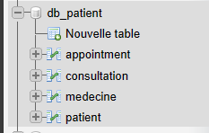
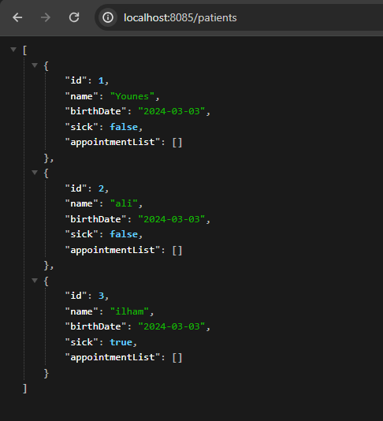

# Activité Pratique N°2 : ORM, Jpa, Hibernate Spring Data


### - 3. Créer l'entité JPA Patient ayant les attributs :

```java
@Entity
@AllArgsConstructor @NoArgsConstructor @Data

public class Patient {

    @Id @GeneratedValue(strategy = GenerationType.IDENTITY)
    private Long id;
    private String name;
    @Temporal(TemporalType.DATE)
    private Date birthDate;
    private Boolean sick;

}
```
> expliquation

- @Entity : pour indiquer que cette classe est une entité JPA
- @Id : pour indiquer que l'attribut id est la clé primaire
- @GeneratedValue : pour indiquer que la clé primaire est auto-générée
- l'entite patient contient les attributs : id, name, birthDate ( annee de naissance ), sick (malade) 


### - 4.4. Configurer l'unité de persistance dans le ficher application.properties

- la configuration de la base de données H2
```java
server.port=8085
spring.datasource.url=jdbc:h2:mem:patient-db
spring.h2.console.enabled=true
```
- la configuration pour la base de données MYSQL

```java
spring.datasource.url = jdbc:mysql://localhost:3306/db_Patient?createDatabaseIfNotExist=true
spring.datasource.username = root
spring.datasource.password =
spring.jpa.hibernate.ddl-auto = update
spring.jpa.properties.hibernate.dialect = org.hibernate.dialect.MariaDBDialect

```

### 6. Tester quelques opérations de gestion de patients :

- Ajouter des patients

```java
  @Override
    public Patient registerPatient(Patient p) {
        return  patientRepository.save(p);
    }
```

```java
Stream.of("Younes", "ali", "ilham").forEach(nom -> {
     Patient patient = new Patient();
     patient.setName(nom);
     patient.setBirthDate(new Date());
     patient.setSick(!(Math.random() > 0.5));
     iHospitalService.registerPatient(patient); 
});
```
- Consulter tous les patients

```java
    @Query("SELECT p FROM Patient p")
    public List<Patient> getAll();
```
> Expliquation 
> -  <strong>@Query</strong> : pour indiquer que la méthode doit exécuter une requête JPQL ( java persistence query language)


#### les autres opérations de gestion de patients sont :

    - Consulter un patient
    - Chercher des patients
    - Mettre à jour un patient 
    - supprimer un patient

```java
    public Optional<Patient> findById(Long id);

    @Query("SELECT p FROM Patient p WHERE p.name like %:kw%")
    public List<Patient> searchByKeyword(@Param("kw") String keyword);

    public void deleteById(Long id);

    public void updateById(Long id);
```

### 7. Migrer de H2 Database vers MySQL

> il faut changer la configuration de la base de données dans le fichier application.properties

```java
spring.datasource.url = jdbc:mysql://localhost:3306/db_Patient?createDatabaseIfNotExist=true
spring.datasource.username = root
spring.datasource.password =
spring.jpa.hibernate.ddl-auto = update
spring.jpa.properties.hibernate.dialect = org.hibernate.dialect.MariaDBDialect
```

- Resultat de la migration
> on peut voir que la base de données H2 a été migrée vers la base de données MYSQL
> 


### 8. Reprendre les exemples  du Patient, Médecin, rendez-vous, consultation, users et roles de la vidéo

- Créer les entités JPA Médecin, Rendez-vous, Consultation, Users et Roles

> Diagramme de classe 


> l'entité <strong>Patient</strong>
```java
@Entity
@AllArgsConstructor @NoArgsConstructor @Data

public class Patient {

    @Id @GeneratedValue(strategy = GenerationType.IDENTITY)
    private Long id;
    private String name;
    @Temporal(TemporalType.DATE)
    private Date birthDate;
    private Boolean sick;

    @OneToMany(mappedBy = "patient", fetch = FetchType.LAZY)
    private Collection<Appointment> appointmentList;
}

```    

> l'entité <strong>Medecine</strong>
```java


public class Medecine {

    @Id
    @GeneratedValue(strategy = GenerationType.IDENTITY)
    private Long id;
    private String name;
    private String email;
    private String specialite;

    @OneToMany(mappedBy = "medecine", fetch = FetchType.LAZY)
    private Collection<Appointment> appointment;
}
```
> l'entité <strong>Rendez vous</strong>

```java
@Entity
@AllArgsConstructor @NoArgsConstructor @Data
public class RendezVous {

    @Id @GeneratedValue(strategy = GenerationType.IDENTITY)
    private Long id;
    @Temporal(TemporalType.TIMESTAMP)
    private Date date;
    @ManyToOne
    private Medecin medecin;
    @ManyToOne
    private Patient patient;

}
```

> l'entité <strong>Consultation</strong>   

```java
@Entity
@AllArgsConstructor @NoArgsConstructor @Data
public class Consultation {

    @Id @GeneratedValue(strategy = GenerationType.IDENTITY)
    private Long id;
    @Temporal(TemporalType.TIMESTAMP)
    private Date date;
    private String description;
    @ManyToOne
    private Medecin medecin;
    @ManyToOne
    private Patient patient;

}
```

## le Test d'un web service RESTful pour la gestion des patients

### get all patients

```java

@GetMapping("/patients")
    public List<Patient> getAllPatients() {
        return iHospitalService.getAll();
    }
```
### Test avec : http://localhost:8085/patients
[]